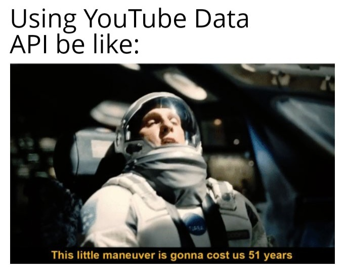

# stefanodesaraca-YouTube-Videos-Data-Prediction-with-Machine-Learning
This project aims to: scrape videos data of a given YouTube channel using the YouTube Data API V3, execute a complete EDA and predict future videos' data.
The project comprehends a list of options accessible from a menu which let the user:
1. Download the video's data of the chosen YouTube channel
2. Convert the JSON file containing the videos' data into CSV
3. Get a full EDA and Machine Learning analysis of the dataset

The EDA includes various insights on the data and a Shapiro-Wilk normality test to check if the distribution of the variables is a normal\
The Machine Learning analysis includes:
1. Feature selection process using the "Forward" method implemented through a RandomForestRegressor and comparison of the results with the ones obtained from a different approach (L1 Penalization)
2. Videos' data prediction with different algorithms and export of the results

 

<h4>Thanks to:</h4>
stvar: https://stackoverflow.com/a/65899758/25647133

<h4>Useful information:</h4>
How to find the Channel ID of a YouTube Channel: https://www.youtube.com/watch?v=zNABOcxGkt8

 
 
 

  

